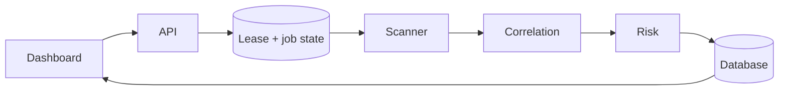

# ECDAT project knowledge

Last verified: 2026-09-10
Repository: `https://github.com/tishanbrijesh-rgb/RNSIT-personal.git`
Active branch: `fix/sha1-recommendation`

## Purpose

ECDAT is the ImpactX privacy-first cryptographic discovery and assurance
prototype. It scans repositories without executing their code, correlates evidence
from independent collectors, measures confidence separately from coverage, and
produces explainable quantum-risk and migration guidance.

## Architecture



1. The React 18 dashboard authenticates users and calls the FastAPI API.
2. FastAPI validates roles, scan roots, limits and request data, then launches one
   isolated scanner child process.
3. Python AST, auditable multi-language rules, dependency manifests and X.509
   certificates produce normalized evidence.
4. Correlation groups evidence by file, operation, algorithm and usage while
   retaining disagreements.
5. Confidence, coverage, conflicts, blind spots and the Mosca-style risk model are
   calculated independently and persisted through SQLAlchemy.
6. Alembic manages schema migrations (0001 baseline, 0002 scan_failures,
   0003 remove_implicit_creation, 0004 scan_leases). PostgreSQL 16 is used by Docker Compose;
   SQLite remains available for local development and tests.
7. Inventory, CBOM, risk report, evidence graph, audit history and benchmark
   evaluation are exposed through authenticated API endpoints.

The highest-connectivity components in the current Graphify model are
`scan_with_metrics()`, `ScanJobDB`, `run_scan()`, `correlate()` and the scan-control
tests. Graphify reports no import cycles.

## Security and execution contract

- There are no default credentials. `ECDAT_USERS_JSON`, `ECDAT_TOKEN_SECRET` and
  `ECDAT_DB_PASSWORD` must be supplied outside Git.
- Data endpoints require signed sessions. Role-header impersonation is disabled by
  default.
- Scan roots, file size, file count and timeout are bounded. A process-level lock
  plus database-backed expiring leases coordinate claims, and authorized users can cancel local workers.
- Linked files are not read. Oversized, malformed or failed supported files reduce
  measured coverage instead of being silently counted as processed.
- Scanner workers are separate child processes, but they are not a complete OS
  sandbox or memory boundary. Run one Uvicorn worker until admission and
  cancellation are coordinated outside the process.
- The dashboard production image is a multi-stage Node 22 build served by
  unprivileged nginx. Node, npm and development dependencies are absent at runtime.
- The backend image runs as UID/GID 10001 and does not contain compilers or build
  headers.
- Production schema management is migration-only (`ECDAT_AUTO_CREATE_TABLES=false`);
  local mode allows implicit creation (`true` by default).

## Current verification evidence

The 2026-09-07 local verification produced these results:

- 118 backend unit/API/regression tests pass, 1 skips, and 84 subtests pass. Migration tests restore
  `DATABASE_URL`, preventing cross-test scan-worker failures.
- 8/8 Alembic migration tests pass (upgrade, downgrade, data preservation, graph).
- 22 frontend unit tests and 7 Chromium end-to-end tests passed; the full
  E2E suite passed three consecutive times.
- Python compilation, dependency consistency, Bandit medium/high analysis,
  TypeScript, Prettier and the Vite production build pass.
- `pip-audit` and `npm audit` reported no known application dependency
  vulnerabilities.
- No credential signatures or oversized tracked files were found.
- Two final disposable Docker/PostgreSQL verifier invocations passed three
  consecutive rounds each after both production images were hardened. They checked
  readiness, authentication, scanning, CBOM/evaluation output, dashboard delivery,
  PostgreSQL connectivity and persistence after backend restarts, then removed its
  containers and volume.
- The dashboard runtime image is approximately 26 MB; the backend runtime image is
  approximately 77 MB.

## Accuracy evidence

- External benchmark v2: 45 operation labels, with the final scanner result repeated
  deterministically at 45 true positives, 0 false positives and 0 false negatives.
- Independently reviewed v3 holdout: 8 labels across seven complete Java files,
  repeated deterministically at 8 true positives, 0 false positives and 0 false
  negatives.
- These consumed, narrow corpora prove the recorded regressions. They do not prove
  general accuracy across every language, library or crypto category.
- The latest large local scan of `C:\Python314` processed 2,303 of 2,314 supported
  files (99.52%) in 105,485 ms and produced 1,181 evidence records. Its eleven
  failures were exposed only as relative paths and fixed safe categories, so
  this is a scale/coverage check rather than an accuracy claim.
- Certificate deprecation warnings and metadata failures now follow a controlled
  error path while later valid PEM blocks continue.

## Phase 3 completion summary

- Alembic 1.19.2 configured with `env.py`, `alembic.ini`, and `ScriptDirectory`.
- Four migrations: 0001_baseline, 0002_scan_failures, 0003_remove_implicit_creation and 0004_scan_leases.
- `ScanFailureDB` model with FK relationship and cascade delete.
- `ScanJobResponse` schema coerces ORM objects via `ConfigDict(from_attributes=True)`
  and `field_validator(mode="before")`.
- Legacy `__failed_file__:` entries stripped from `blind_spots` by schema validators.
- `ECDAT_AUTO_CREATE_TABLES` env var guards production `create_all`.
- `docker-compose.yml` sets `ECDAT_AUTO_CREATE_TABLES: "false"`.

## Running the system

Backend: `http://localhost:8000`
Dashboard: `http://localhost:3000`
Login: use the account configured in the untracked project-root `.env` file.

Start commands:
```powershell
# Backend
cd "C:\Users\Tishan Kumar B\Desktop\ImpactX\ECDAT-ImpactX"
.venv\Scripts\python.exe -m uvicorn backend.main:app --host 0.0.0.0 --port 8000

# Dashboard
cd "C:\Users\Tishan Kumar B\Desktop\ImpactX\ECDAT-ImpactX"
cd dashboard && npx vite --host 0.0.0.0 --port 3000
```

## Important commands

```powershell
# Complete local code gate
.\scripts\verify_release.ps1

# Real disposable Docker/PostgreSQL test
.\.venv\Scripts\python.exe -m scripts.verify_compose

# Migration tests
.\.venv\Scripts\python.exe -m pytest tests/test_alembic_migrations.py -v

# Scanner CLI
.\.venv\Scripts\python.exe -m scanner.main test-repo

# External benchmark
.\.venv\Scripts\python.exe -m scripts.benchmark_external --manifest benchmarks\external-v3.json --repeat 3
```

## Current limitations and next work

- Stages 1–4, Phase 3 migrations, and the scoped frontend/release hardening are complete.
- Production SSO, TLS termination, secret management, backup/restore, distributed
  scan admission, hardened OS sandboxing and high availability remain future work.
- React 19, Recharts 3 and TypeScript 7 are optional major migrations, not current
  security fixes.
- Browser-download checks, presentation recording and offline screenshots remain
  presentation-machine tasks.

## Canonical references

- `README.md` — setup, product behavior and commands
- `docs/ARCHITECTURE.md` — system flow and assurance principles
- `docs/THREAT_MODEL.md` — trust boundaries and remaining threats
- `docs/five-step-verification.md` — detailed verification evidence
- `docs/verification-2026-09-10.md` — latest full local audit, limitations and next work
- `docs/INDEX.md` — documentation and diagram map
- `docs/stages-1-4-verification-2026-09-07.md` — completed implementation and repeated verification evidence
- `docs/improvement-plan-2026-09-07.md` — staged implementation and verification plan
- `docs/authentication.md` — account and secret configuration
- `benchmarks/README.md` — external benchmark protocol
- `MEMORY.md` — concise handoff state for future work
- `LOGIN_CREDENTIALS.md` — local dev credentials
- `CLAUDE_HANDOFF_PROMPT.md` — handoff instructions for Claude sessions
